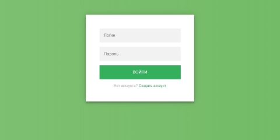

# Конвертер валют

**Описание:**

Конвертация валют на основе курсов [ЦБРФ](http://www.cbr.ru/scripts/XML_daily.asp). Конвертация доступна после авторизации. Также введется история конвертаций.

**Результаты:**

  

Авторизовавшись пользователь попадает на главную страницу.

  

 При написании приложения использовалась Java 11, Spring Boot 2. Шаблонизатор Thymeleaf и СУБД PostgreSQL 12.

## Настройка
### 1. Application properties
Отредактировать application.properties, указав адрес, порт, название БД, пользователя и пароль. Файл с параметрами находится в папке ..\src\resources.

### 3. Подготовка БД
Создание таблиц руками с помощью готового SQL файла или автоматичкая генерация таблиц.
Ручная: в папке ..\sql лежит "create table.sql" для создания таблиц БД. 
Автоматичская: см. пункт 1, изменить spring.jpa.generate-ddl=false на spring.jpa.generate-ddl=**true**

### 3. Maven
Собрать приложение с помощью pom.xml